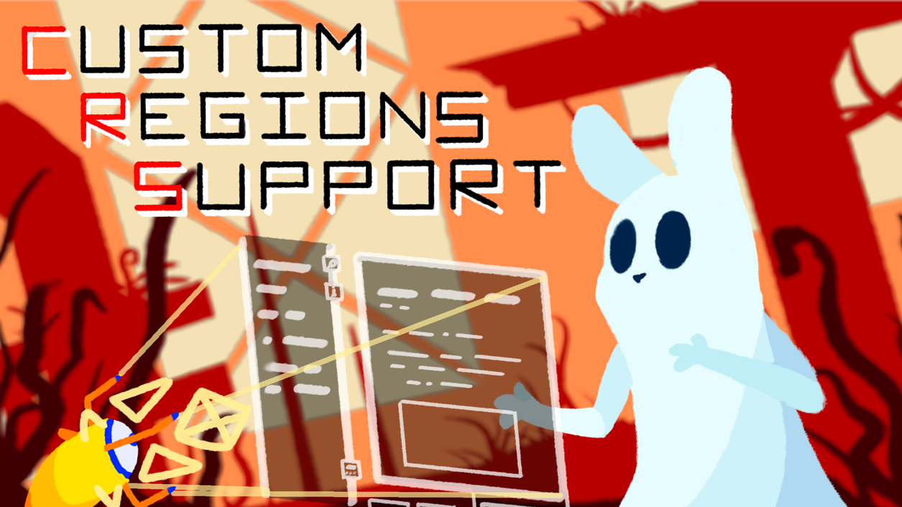

## Warning! You are seeing the *beta* version of CRS (Rain World v1.9 / Downpour), for the legacy version (v1.5), please visit [here](https://github.com/Garrakx/Custom-Regions)!
***
# Custom Regions Support (CRS)
***
## Adds various meta features to Custom Regions

## Index

### How to compile
1. Place references in "lib" folder

Creating the System Variable:
2. type env in the windows search bar, 
3. choose the first one
4. Press n
5. add a new system variable called `RainWorldDir`

### Feature List

* **Custom Procedural Music**  
(Add just like vanilla does)

* **Region Landscape Art**  
Uses a new config file with the same name as landscape folder 
to assign depths and optionally shaders - old depths file will still work.

* **Custom Level Unlocks**  
Level unlocks are read from  CustomUnlocks.txt.  
Format is as follows:  

    TokenID : ArenaName1, ArenaName2, ArenaName3, ect.  
    

The TokenID must be unique,  
so it's good to pick a name that won't be likely to be picked  
by another region mod.  

Since this a single file,  
region mods should extend this file with modification files.  

As an example: 

    aetherridge\modify\CustomUnlocks.txt
        [ADD]AR1 : Station, Complex, Floor
        [ADD]AR2 : Exhaust, Array, Research
        [ADD]AR3 : Aeolian, Hull, Decay
    
* **Custom Pearls**  
Custom Pearl data is read from  CustomPearls.txt.  
Format is as follows:  

    PearlID : MainColor : HighlightColor : ConversationFileName  
    
The PearlID must be unique,  
so it's good to pick a name that won't be likely to be picked  
by another region mod.  

Conversation files go inside Text\text-eng\  
and can have any filename,  
as long as it matches what's in CustomPearls.txt  

Since this a single file,  
region mods should extend this file with modification files.  

As an example: 

    aetherridge\modify\CustomUnlocks.txt
        [ADD]AR_Ridge_Pearl_1 : f56942 : e1603b : AR_Tram
        [ADD]AR_Ridge_Pearl_2 : e805e8 : ff72ff : AR_Picture
        [ADD]AR_Heat_Pearl : a6f781 : 7bff39 : AR_Shipping
        
    aetherridge\Text\text-eng\
        AR_Tram.txt
            0-46
            First line of the first text box.<LINE>Second line of the first text box.
            This line will be shown in a second text box!
            
        AR_Picture.txt
            0-118
            The 2nd number in the 1st line literally doesn't matter rn
            I removed that check because it's annoying
            Although both numbers still need to be there
            
        AR_Shipping.txt
            Honestly the 1st number might also not matter I'm not sure
            
        AR_Shipping-Artificer.txt
            You can also append a slugcat name
            For slug-specific conversations

* **Add Region to Story Regions (used for Wanderer requirements)**  
* **Add Region to Optional Regions (visitable and has Safari menu)**  
* **Remove Region from Safari Menu (active by default)**  

The above are assigned with the new MetaProperties.txt  
Which goes in World\XX  
Proper useage goes like this:  

    White,Yellow,Rivulet : Story  
    Gourmand,Hunter : Optional  
    Safari  

The region will only be a part of the passage requirements for  
Survivor, Monk, and Rivulet  
but Hunter and Gourmand will be able to visit and passage to it  
And the region will appear in the Safari menu  

You can also use X- syntax from the world file  

    X-Saint : Story  

This is available to every slugcat except Saint  

To make a region a story region for every slugcat, simply write

    Story  

Same goes for optional regions.  

    Optional

Safari can't have slugcat conditional syntax,  
as it uses Story\Optional regions for slug-accessibility.  

* **Region Conditional Lines**  
A line can be excluded if it doesn't match defined conditions.  
The current available conditions are:  
-Is MSC enabled?  
-Is a specific region acronym present?  
-Is a specific modID active?  

The formatting looks like this  

    {MSC}SU_C04 : SU_CAVE01, SU_PC01, SU_A41
    {!MSC}SU_C04 : DISCONNECTED, SU_PC01, SU_A41

Put an ! anywhere in the condition to invert it  
which in this case makes the 1st line happen if MSC is active  
and the 2nd line happen if MSC is not active  

Conditions can be stacked, like so  

    //this line happens if AR is a region but TR isn't
    {AR,!TR} 
    
    //this line happens if MSC isn't active and PC is a region
    {!MSC,PC} 
    
    //# is used as the first character to mark it as an id
    {#!lb-fgf-m4r-ik.coral-reef} 
    
    //all of these can be applied to creatures as well
    //useful for soft creature dependencies
    {#lb-fgf-m4r-ik.coral-reef}OS_D09 : 3-Polliwog-2
    {#!lb-fgf-m4r-ik.coral-reef}OS_D09 : 3-Salamander
    
    //when combined with slug conditions, the slugcat should come first
    (White,Yellow){MSC}VI_A19 : 2-Yeek-3
    (White,Yellow){!MSC}VI_A19 : 2-CicadaB-3
